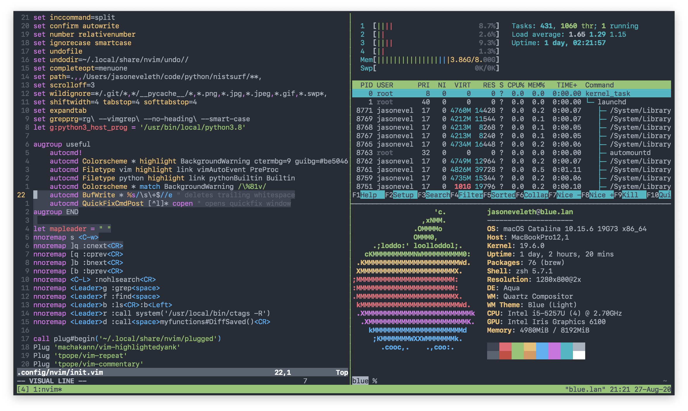

# Dim

**Dim** (a contraction of **Default IMproved**) is a clone of Vim’s default colorscheme, with some improvements:

* It only uses [ANSI colors], so you can assign colors in your terminal emulator yourself
* Syntax highlighting is consistent on light and dark backgrounds

[ANSI colors]: https://en.wikipedia.org/wiki/ANSI_escape_code#Colors

This is a fork from [jeffkreeftmeijer/vim-dim](https://github.com/jeffkreeftmeijer/vim-dim)

The major changes are:

* Visual highlighting using black

## Example

